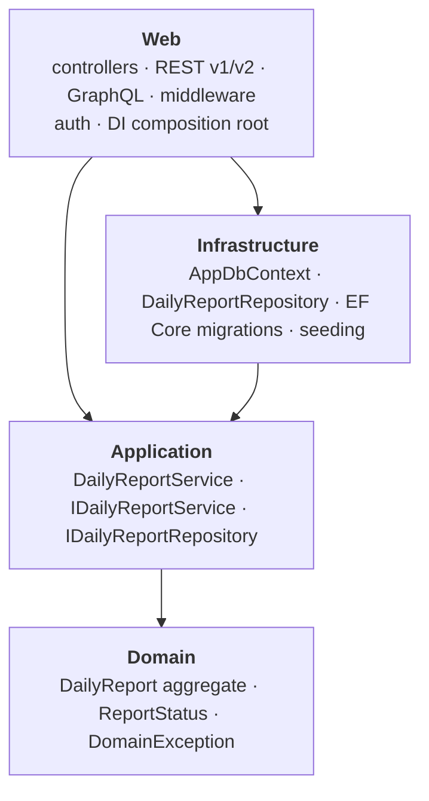

# Architecture

## What this project explores

Approval workflows in enterprise construction IT are usually spread across
layers: some rules in application code, some in stored procedures, some in a
BPM platform's routing configuration. It works, but the rules are scattered,
hard to see in one place, and hard to test in isolation.

This project takes the opposite approach — the workflow rules live in one
domain entity with an explicit state machine, the rest of the system is
layered around it with a strict dependency rule, and everything is covered
by automated tests. The construction daily report is the domain; the
engineering approach is the point.

The domain is kept deliberately small (one aggregate, a linear state
machine). That is a choice: it keeps the focus on the layering, the testing,
and the delivery pipeline rather than on reproducing a full workflow engine.

## Layers and the dependency rule



Dependencies point inward. The **Domain** project has no project
references. **Application** depends only on Domain. **Infrastructure**
depends on Application — it implements Application's interfaces. **Web**
depends on Application and Infrastructure and wires everything together at
startup (the composition root).

The practical effect: the domain rules and the service layer can be
compiled and tested with no database, no web host, and no framework beyond
the BCL.

## Domain

`DailyReport` is the only aggregate. It owns the workflow:

```
Draft ──Submit──▶ Submitted ──StartReview──▶ UnderReview ──Approve──▶ Approved
                       │                          │
                       └────────Reject────────────┴──▶ Rejected
```

Every transition is a method on the entity that checks the current state
and throws `DomainException` if the move is not allowed: `Submit()` only
from `Draft`, `StartReview()` only from `Submitted`, `Approve()` only from
`UnderReview`, `Reject(reason)` from `Submitted` or `UnderReview` (and it
requires a reason). Construction invariants — project id required, work
description required, worker count greater than zero — are enforced in the
`DailyReport.Create` factory. There is no public constructor and no public
setter; the entity cannot be put into an invalid state from outside.

`DomainException` is caught once, in `GlobalExceptionMiddleware`, and mapped
to `400 Bad Request`.

## Application

`DailyReportService` coordinates use cases (create, submit, start review,
approve, reject, query). It has no business rules of its own — it loads the
aggregate through `IDailyReportRepository`, calls a domain method, and
saves. `KeyNotFoundException` from a missing report maps to `404`.

`IDailyReportRepository` is defined here, in the Application layer, and
implemented in Infrastructure. That inversion is what lets the service be
unit-tested against a mocked repository with no database.

## Infrastructure

`DailyReportRepository` implements `IDailyReportRepository` over
`AppDbContext` (EF Core, SQL Server). `DailyReportConfiguration` maps the
entity — `ReportStatus` is persisted as a string, sensible column lengths,
indexes on the columns the queries filter by. Read queries use
`AsNoTracking`.

**Why EF Core and a repository interface rather than stored procedures.**
Stored-procedure data access is fast to write and performs well, but the
logic ends up in the database where it is hard to unit-test and hard to
review alongside the code that calls it. Here the persistence concern is
behind an interface owned by the Application layer, so the same service
code runs in tests against an in-memory fake and in production against SQL
Server. `AsNoTracking` and the indexes cover the read-heavy paths without
giving that up.

Migrations target SQL Server. In `Development` with no connection string
configured, the app instead creates a local SQLite file and seeds a few
sample reports, so `dotnet run` works with nothing installed but the SDK.

## Web

Two HTTP APIs over the same `DailyReportService` and the same
authorization model:

| Surface | Purpose |
|---|---|
| REST v1 (`/api/v1/reports`) | Full read/write surface. Deprecated. `status` is an integer. |
| REST v2 (`/api/v2/reports`) | Read-only. `status` is a string, `statusCode` kept for reference. Writes stay on v1. |
| GraphQL (`/graphql`) | `reportsByProject`, `pendingReviews` queries; `createReport`, `submitReport` mutations. Field selection on reads. |
| MVC (`/Report`, `/Approval`) | Server-rendered views over the same service. No login page — the API is the primary interface. |

**Why both REST and GraphQL.** REST carries the versioned, documented
contract (OpenAPI / Swagger) that external callers depend on and that the
deployment smoke test exercises. GraphQL lets a client pull exactly the
fields it needs from the read side without a new endpoint per shape. Both
go through the same service layer, so there is no second copy of the
business logic — only a second transport. The cost is a second API to keep
in sync, which is the trade-off documented on each pull request that
touched it.

**Authorization.** JWT bearer authentication on every endpoint. Roles:
`Worker` files and submits reports; `Supervisor` and `ProjectManager`
review them. The same rule is enforced on REST, MVC, and GraphQL — a
`Worker` creating via any of the three succeeds; a `Supervisor` creating is
rejected. `POST /api/auth/token` issues tokens for the demo (see
*Out of scope*).

**Cross-cutting** (all configured in `Program.cs`):

| Concern | Where |
|---|---|
| Correlation IDs | `CorrelationIdMiddleware` — assigns an id, pushes it to Serilog and onto the request so error responses carry it |
| Error handling | `GlobalExceptionMiddleware` — `DomainException` → 400, `KeyNotFoundException` → 404, everything else → 500 |
| Structured logging | Serilog, compact JSON to console |
| Rate limiting | Fixed window, 60 req/min, partitioned by user identity, then `X-Forwarded-For`, then connection IP. The forwarded header is trusted because Azure App Service's front end overwrites it; set `ASPNETCORE_FORWARDEDHEADERS_ENABLED=true` if fronted by a different proxy |
| Health checks | `/health/live` (liveness), `/health/ready` (readiness, includes the DB) |
| Secrets | Azure Key Vault + Managed Identity in non-Development environments; skipped locally |
| Telemetry | Azure Application Insights |
| Background work | `StaleReportDetectionService` — scans daily for reports stuck in Draft |

## Testing

- **Unit** — `DailyReport` state machine and invariants; `DailyReportService`
  against a mocked `IDailyReportRepository`. No database.
- **Integration** — `WebApplicationFactory<Program>` with the DbContext
  swapped for the in-memory provider: routing, JWT authentication, role
  authorization (REST, MVC, GraphQL), API versioning, the correlation-id
  middleware, the repository against a real provider.
- **Coverage gate** — an 80% average line threshold enforced in CI, scoped
  to the Domain and Application layers (the layers where a regression is a
  logic bug rather than a wiring bug).

The suite also runs inside the Docker build, so a broken image fails CI.

## CI/CD

- **Every pull request:** `build-and-test` (restore, build, `dotnet test`
  with the coverage gate) and `docker-build` (the multi-stage image builds
  and its in-container tests pass). Both must be green to merge.
- **Merge to `main`:** `migrate` (EF Core migrations against Azure SQL) →
  `deploy` (`dotnet publish` to Azure App Service via OIDC) → `smoke-test`
  (liveness, readiness, and Swagger against the live site).

The container image is a portability exercise and a second test gate; it is
not the deployment artifact — the hosted demo runs on free-tier App Service
from `dotnet publish`.

## Deliberately out of scope

The domain simplifications (delegation, escalation, multi-step routing) and
the POC shortcuts (demo token endpoint, public Swagger, no optimistic
concurrency, no login UI) are listed in the README's
[Out of scope](README.md#out-of-scope) section.

A known hardening backlog — resource/ownership-level authorization,
fail-fast on a missing signing key, non-root container, the GraphQL HTTP
status for auth failures — is tracked as a follow-up (CDRA-71).
