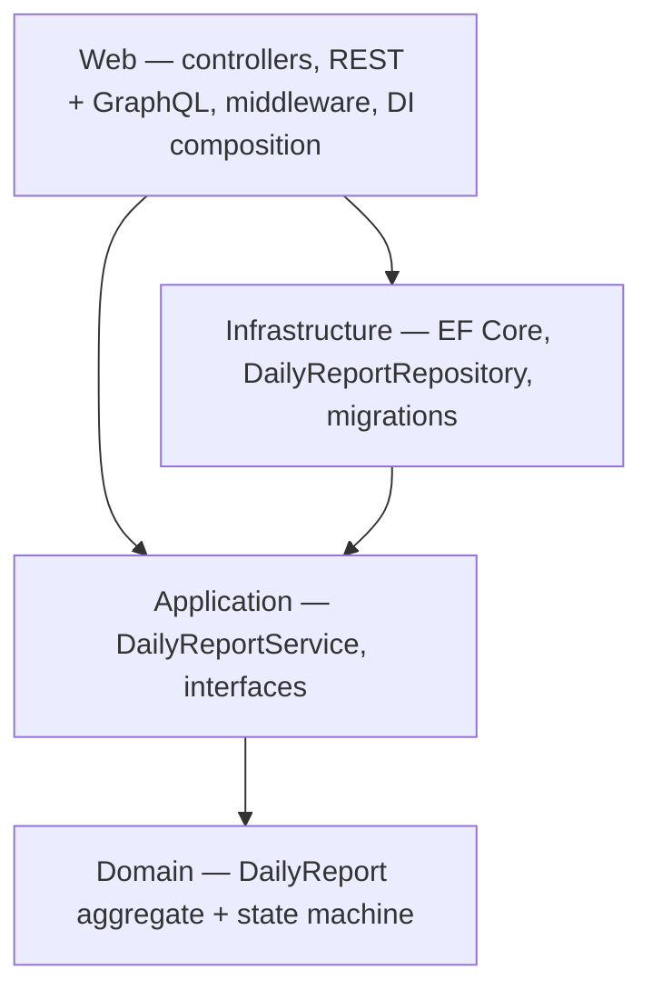

# Construction Daily Report Approval System

[](https://github.com/yhlinbim/construction-daily-report-system/actions/workflows/ci.yml)

## Live Demo

Swagger UI: https://cdrs-poc-hansl-hnh3gvavdsf7b3a5.australiaeast-01.azurewebsites.net/swagger

Running on Azure App Service (Australia East), deployed automatically via GitHub Actions.

## Background

Approval workflows in enterprise environments are often spread across
multiple layers — application code handles some logic, stored procedures
handle data access and transformations, platform configuration handles
routing. It works, but the business rules are scattered and hard to test.

I built this to explore what the same workflow looks like when the
business rules are consolidated in a domain entity with a clear state
machine, properly layered with Clean Architecture, and covered by
automated tests. The construction site daily report is the domain
context; the engineering practices are the point.

This is a side project applying modern .NET practices —
Clean Architecture, automated testing, and CI/CD — to a
business domain I know from real-world construction IT work.

## What it does

A simplified approval workflow for construction site daily reports,
modelling the core state transitions:

```
Draft → Submitted → UnderReview → Approved
                                ↘ Rejected
```

Real-world approval workflows are more complex — delegated signing,
escalation, rejection to specific steps, proxy approval. This project
focuses on the engineering fundamentals: how to model a state machine
in a domain entity, enforce business rules, and test them in isolation.

## How it's structured



Dependencies point inward. Domain has no project references; Application
depends only on Domain; Infrastructure implements Application's interfaces;
Web wires everything together. The business rules live in the domain
entity, the service layer coordinates the steps, and controllers just
handle HTTP.

See [ARCHITECTURE.md](ARCHITECTURE.md) for the full rationale — why the
domain is kept small, why EF Core over stored procedures, why a dual API,
and what is deliberately out of scope.

## Technology Stack

| Category | Technology | Purpose |
|----------|-----------|---------|
| Framework | ASP.NET Core 8 | Web API + MVC |
| ORM | Entity Framework Core 8 | Database access |
| Database (local) | SQL Server LocalDB | Development |
| Database (cloud) | Azure SQL Database (Serverless) | Production |
| Testing | xUnit + Moq + FluentAssertions | Unit + Integration tests |
| Logging | Serilog (structured JSON) | Structured request logging |
| Monitoring | Azure Application Insights | Production telemetry and alerting |
| Authentication | JWT Bearer + RBAC | API security |
| API | REST + GraphQL (Hot Chocolate) | Dual read/write API |
| API Versioning | Asp.Versioning 8.1.0 | URL-based versioning (v1/v2) |
| Rate Limiting | Fixed Window (60 req/min) | API protection |
| Secret Management | Azure Key Vault + Managed Identity | Production secrets |
| Containerisation | Docker (multi-stage build) | Portability exercise; CI-verified, not the deploy path |
| CI/CD | GitHub Actions → Azure App Service | Automated build, test, and deploy |
| Cloud | Azure App Service (Australia East) | Hosting |

## Engineering Practices

- **Domain-driven design**: Aggregate with state machine, domain exceptions enforced at the domain layer
- **Testing**: 95 unit and integration tests (AAA pattern, Moq for isolation); 80% average line-coverage threshold enforced in CI for the Domain and Application layers
- **CI/CD**: Automated quality gate — failing tests block deployment; separate migration job before deploy
- **Structured logging**: Serilog with Correlation ID middleware for end-to-end request tracing
- **Security**: No secrets in source control; environment-based configuration; Azure Key Vault + Managed Identity for production secrets
- **API design**: REST and GraphQL both expose reads and writes; every endpoint requires JWT authentication with role-based authorization — Workers file and submit reports, Supervisors and Project Managers review them
- **API versioning**: URL-based versioning — v1 deprecated, v2 introduces breaking change (status as string)
- **Rate limiting**: Fixed window (60 req/min) partitioned by user identity, falling back to IP
- **CORS**: Configuration-driven allowed origins per environment — no hardcoded values
- **Monitoring**: Azure Application Insights for request tracking, exception monitoring, and EF Core dependency telemetry
- **Containerisation**: Multi-stage Dockerfile (restore → test → publish → slim runtime); `docker build` runs on every pull request with the test suite executing inside the build
- **Project management**: Git feature-branch workflow, PR reviews with written technical decision rationale on every pull request, Jira Scrum board across 6 sprints

Each pull request includes written rationale for the technical decisions made — see the PR history for the full record.

## Tests

95 tests across the four layers — domain, application (services), infrastructure
(repository), and web (controllers and GraphQL). All passing in CI on every push,
and again inside the Docker build. An 80% average line-coverage threshold is
enforced in CI, scoped to the Domain and Application layers.

## API Versions

| Version | Status | Notes |
|---------|--------|-------|
| v1 | Deprecated | `status` returns an integer; full read/write surface |
| v2 | Active | `status` returns a string, `statusCode` added for reference; read-only — writes use v1 |

## Out of scope

Deliberate simplifications for a portfolio project:

- **Authentication vs. identity** — JWT validation and role checks are enforced on every
  endpoint, but `POST /api/auth/token` issues a token for any username with a valid role.
  There is no user store or password check; user management is not modelled.
- **Swagger is public** — served in every environment; the deployment smoke test depends on it.
- **No optimistic concurrency** — the aggregate has no row-version token, so concurrent
  edits are last-write-wins.
- **No login UI** — the REST API and Swagger are the interface. The MVC views exist but
  there is no sign-in page.
- **One aggregate, linear workflow** — delegation, escalation, multi-step routing and
  rejection-to-step (see *What it does*) are intentionally not built.

## Running locally

### Quickest — no database

```bash
git clone https://github.com/yhlinbim/construction-daily-report-system
cd construction-daily-report-system
dotnet run --project CDRS.Web
```

In `Development` with no connection string configured, the app creates a
local SQLite file (`CDRS.Web/cdrs-dev.db`, gitignored) and seeds a few
sample reports. Open <http://localhost:5xxx/swagger> — the console prints
the port. Delete the `.db` file to reset.

Only the .NET 8 SDK is required.

### With SQL Server via docker-compose

```bash
cp .env.example .env      # then set MSSQL_SA_PASSWORD
docker compose up --build
```

App + SQL Server, EF Core migrations applied on start. App on
<http://localhost:8080/swagger>.

### With your own SQL Server

Run SQL Server, then point the app at it and apply migrations:

```bash
export ConnectionStrings__DefaultConnection="Server=localhost;Database=ConstructionDailyReportDb;User Id=sa;Password=...;TrustServerCertificate=True"
dotnet tool install --global dotnet-ef
dotnet ef database update --project CDRS.Infrastructure --startup-project CDRS.Web
dotnet run --project CDRS.Web
```
