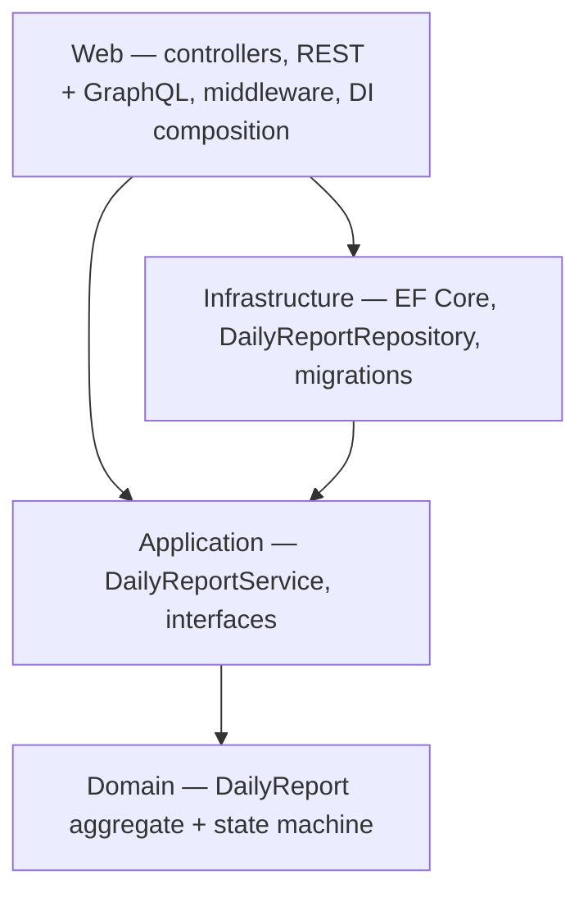

# Construction Daily Report Approval System

[](https://github.com/yhlinbim/construction-daily-report-system/actions/workflows/ci.yml)

## Live Demo

Swagger UI: https://cdrs-poc-hansl-hnh3gvavdsf7b3a5.australiaeast-01.azurewebsites.net/swagger

Running on Azure App Service (Australia East), deployed automatically via GitHub Actions.

## What it does

A simplified approval workflow for construction site daily reports — the
core state transitions modelled in a single domain entity:

```
Draft → Submitted → UnderReview → Approved
                                ↘ Rejected
```

A side project applying Clean Architecture, DDD, automated testing, and
CI/CD to a domain I know from construction IT work. The domain is kept
deliberately small; the engineering approach is the point.

## How it's structured



Dependencies point inward: Domain has no project references, Application
depends only on Domain, Infrastructure implements Application's interfaces,
Web wires it together.

**[ARCHITECTURE.md](ARCHITECTURE.md)** has the reasoning — why the domain
is small, why EF Core over stored procedures, why a dual API, the
cross-cutting concerns, and what is deliberately out of scope.

## Technology Stack

| Category | Technology | Purpose |
|----------|-----------|---------|
| Framework | ASP.NET Core 8 | Web API + MVC |
| ORM | Entity Framework Core 8 | Database access |
| Database (local) | SQLite (auto) or SQL Server | Development |
| Database (cloud) | Azure SQL Database (Serverless) | Production |
| Testing | xUnit + Moq + FluentAssertions | Unit + Integration tests |
| Logging | Serilog (structured JSON) | Structured request logging |
| Monitoring | Azure Application Insights | Production telemetry and alerting |
| Authentication | JWT Bearer + RBAC | API security |
| API | REST + GraphQL (Hot Chocolate) | Dual read/write API |
| API Versioning | Asp.Versioning 8.1.0 | URL-based versioning (v1/v2) |
| Rate Limiting | Fixed Window (60 req/min) | API protection |
| Secret Management | Azure Key Vault + Managed Identity | Production secrets |
| Containerisation | Docker (multi-stage build) | Portability exercise; CI-verified, not the deploy path |
| CI/CD | GitHub Actions → Azure App Service | Automated build, test, and deploy |
| Cloud | Azure App Service (Australia East) | Hosting |

## Highlights

- Clean Architecture with a strict dependency rule; workflow rules in a domain state machine
- 95 unit + integration tests; 80% average line-coverage gate in CI (Domain + Application)
- JWT auth + role-based authorization, enforced identically across REST, MVC, and GraphQL
- REST (v1/v2, OpenAPI) and GraphQL (Hot Chocolate) over one shared service layer
- Serilog structured logging with correlation IDs; rate limiting; health checks; Key Vault
- GitHub Actions: tests + multi-stage Docker build gate every PR; migrate → deploy → smoke-test on `main`
- Every pull request carries written rationale for the decision it makes — see the PR history

How and why each of these works is in **[ARCHITECTURE.md](ARCHITECTURE.md)**.

## API Versions

| Version | Status | Notes |
|---------|--------|-------|
| v1 | Deprecated | `status` returns an integer; full read/write surface |
| v2 | Active | `status` returns a string, `statusCode` added for reference; read-only — writes use v1 |

## Out of scope

Deliberate simplifications for a portfolio project:

- **Authentication vs. identity** — JWT validation and role checks are enforced on every
  endpoint, but `POST /api/auth/token` issues a token for any username with a valid role.
  There is no user store or password check; user management is not modelled.
- **Swagger is public** — served in every environment; the deployment smoke test depends on it.
- **No optimistic concurrency** — the aggregate has no row-version token, so concurrent
  edits are last-write-wins.
- **No login UI** — the REST API and Swagger are the interface. The MVC views exist but
  there is no sign-in page.
- **One aggregate, linear workflow** — delegation, escalation, multi-step routing and
  rejection-to-step (see *What it does*) are intentionally not built.

## Running locally

### Quickest — no database

```bash
git clone https://github.com/yhlinbim/construction-daily-report-system
cd construction-daily-report-system
dotnet run --project CDRS.Web
```

In `Development` with no connection string configured, the app creates a
local SQLite file (`CDRS.Web/cdrs-dev.db`, gitignored) and seeds a few
sample reports. Open <http://localhost:5xxx/swagger> — the console prints
the port. Delete the `.db` file to reset.

Only the .NET 8 SDK is required.

### With SQL Server via docker-compose

```bash
cp .env.example .env      # then set MSSQL_SA_PASSWORD
docker compose up --build
```

App + SQL Server, EF Core migrations applied on start. App on
<http://localhost:8080/swagger>.

### With your own SQL Server

Run SQL Server, then point the app at it and apply migrations:

```bash
export ConnectionStrings__DefaultConnection="Server=localhost;Database=ConstructionDailyReportDb;User Id=sa;Password=...;TrustServerCertificate=True"
dotnet tool install --global dotnet-ef
dotnet ef database update --project CDRS.Infrastructure --startup-project CDRS.Web
dotnet run --project CDRS.Web
```
